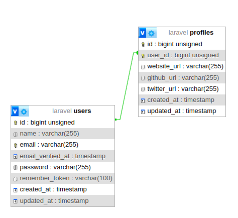

# Laracasts Series - eloquent-relationships

https://laracasts.com/series/eloquent-relationships

- One to One
- One to Many
- Many to Many
- Has Many Through
- Polymorphic Relations
- Many to Many Polymorphic Relations

## One to One - HasOne / BelongTo


__User HasOne Profile & Profile BelongsTo User__

> User HasOne Profile & Profile BelongsTo User<br>
> L'utilisateur a 1 profil et le profil appartient à 1 utilisateur



Migration
```php
        Schema::create('profiles', function (Blueprint $table) {
            $table->id();
            $table->foreignIdFor(\App\Models\User::class)->unique()->constrained()
                ->onUpdate('cascade')
                ->onDelete('cascade');
            $table->string('website_url');
            $table->string('github_url');
            $table->string('twitter_url');
            $table->timestamps();
        });
```

Models:
```php
// App\Models\User
    
    public function profile(): HasOne
    {
        return $this->hasOne(Profile::class);
    }
```

```php
// App\Models\Profile
    public function user(): BelongsTo
    {
        return $this->belongsTo(User::class);
    }
```

Utilisation:
```php 

use App\Models\{Profile, User};

DB::enableQueryLog();

$user = User::find(1);
$user->profile; // @return App\Models\Profile - Une requête SQL est exécutée pour retrouver le Profile
$user->profile(); // @return Illuminate\Database\Eloquent\Relations\HasOne

DB::getQueryLog();
```
