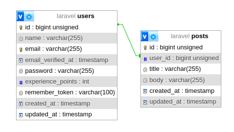
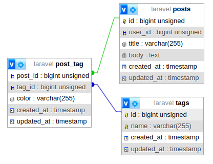
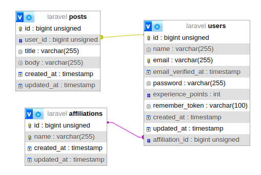
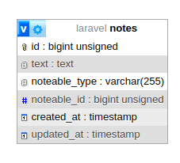
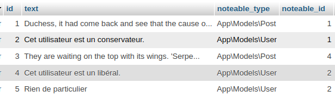
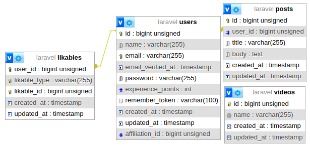
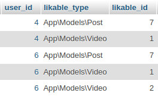

# Laracasts Series - eloquent-relationships

https://laracasts.com/series/eloquent-relationships<br>
https://laravel.com/docs/11.x/eloquent-relationships#querying-relations
https://laravel.com/docs/11.x/eloquent-relationships#aggregating-related-models

- One to One
- One to Many
- Many to Many
- Has Many Through
- Polymorphic One to Many 
- Polymorphic Many to Many

## One to One - HasOne / BelongTo

> User HasOne Profile & Profile BelongsTo User<br>
> L'utilisateur a 1 profil & 1 profil appartient à 1 utilisateur


Migration
```php
        Schema::create('profiles', function (Blueprint $table) {
            $table->id();
            $table->foreignIdFor(\App\Models\User::class)->unique()->constrained()
                ->onUpdate('cascade')
                ->onDelete('cascade');
            $table->string('website_url');
            $table->string('github_url');
            $table->string('twitter_url');
            $table->timestamps();
        });
```

Models:
```php
// App\Models\User
    
    public function profile(): HasOne
    {
        return $this->hasOne(Profile::class);
    }
```

```php
// App\Models\Profile
    public function user(): BelongsTo
    {
        return $this->belongsTo(User::class);
    }
```

Utilisation:
```php 

use App\Models\{Profile, User};

DB::enableQueryLog();

$user = User::find(1);
$user->profile; // @return App\Models\Profile - Une requête SQL est exécutée pour retrouver le Profile
$user->profile(); // @return Illuminate\Database\Eloquent\Relations\HasOne

DB::getQueryLog();
```

## One to Many - HasMany / BelongsTo


> User HasMany Posts & Post BelongsTo User<br>
> L'utilisateur a plusieurs Posts & un Post appartient à 1 utilisateur



Migration:
```php 
        Schema::create('posts', function (Blueprint $table) {
            $table->id();
            $table->foreignIdFor(User::class)->constrained()
                ->onUpdate('cascade')
                ->onDelete('cascade');
            $table->string('title');
            $table->string('body');
            $table->timestamps();
        });
```

Models:
```php
// App\Models\User
    public function posts(): HasMany
    {
        return $this->hasMany(Post::class);
    }

// App\Models\Post
    public function user(): BelongsTo
    {
        return $this->belongsTo(User::class);
    }
```
Utilisation:
```php
use App\Models\{Post, User};

DB::enableQueryLog();

$user = User::find(1);
$user->posts; // Illuminate\Database\Eloquent\Collection Post
$user->posts(); // Illuminate\Database\Eloquent\Relations\HasMany

$posts = Post::where('user_id', $user->id)->get();
$posts = Post::whereBelongsTo($user)->get();

$users = User::where('vip', true)->get();
$posts = Post::whereBelongsTo($users)->get();

DB::getQueryLog();
```

:warning: N+1 Query Problem - Lazy loading
```php
// app/Providers/AppServiceProvider.php
    public function boot(): void
    {
        //Model::shouldBeStrict($this->app->isLocal());
        Model::preventLazyLoading($this->app->isLocal());
    }
```
```php
$user = User::with('posts')->first(); // Illuminate\Database\LazyLoadingViolationException
$user = User::with([
    'posts' => fn ($posts) => $posts->chaperone(),
])->first();

foreach ($user->posts as $post) {
    // Eloquent n'hydrate pas automatiquement la relation du parent (Ici User car Post issue du parent User via loop $user->posts)
    dump($post->user->email);
}
```

## Many to Many - BelongsToMany / BelongsToMany

> Post belongsToMany Tags & Tag belongsToMany Posts<br>
> Un post appartient à plusieurs Tags & un Tag appartient à plusieurs Post 


Cette relation nécessite l'utilisation d'une table pivot liant un modèle à un autre.<br>
Par convention (Default Laravel) le nom de cette table est la jointure des noms de modèles au singulier et par ordre alphabétique.<br>



Migration:
```php
        Schema::create('tags', function (Blueprint $table) {
            $table->id();
            $table->string('name')->unique();
            $table->timestamps();
        });
        
        Schema::create('post_tag', function (Blueprint $table) {
            $table->foreignIdFor(Post::class)->constrained()->onDelete('cascade');
            $table->foreignIdFor(Tag::class)->constrained()->onDelete('cascade');
            $table->timestamps();
            $table->index(['post_id', 'tag_id']);
        });
```

Models:
```php
// App\Models\Post
    public function tags(): belongsToMany
    {
        return $this->belongsToMany(Tag::class)->withTimestamps();
    }
// App\Models\Tag
    public function posts(): belongsToMany
    {
        return $this->belongsToMany(Post::class)->withTimestamps();
    }
```

Utilisation:
```php
use App\Models\{Post, Profile, Tag, User};

$user = User::factory()->create();
$post = Post::find(1);
foreach ($post->tags as $tag) {
    dump($tag->pivot->color);
}

$blue_tags = $post->tags()->wherePivot('color', 'blue')->get();

$post = Post::factory()->create(['user_id' => $user->id]);
$tags = Tag::factory(2)->create();
$tag1 = $tags->first();
$tag2 = $tags->get(1);
$post->tags()->attach([$tag1->id], ['color' => 'red']);
$tag2->posts()->attach([$post->id], ['color' => 'red']);
$post->tags()->detach($tag2->id);

// only the IDs in the given array will exist in the intermediate table
$post->tags()->sync([]);
// not detach existing IDs that are missing from the given array,
$post->tags()->syncWithoutDetaching([]);

// pass additional intermediate table values with the IDs
$post->tags()->sync([1 => ['color' => 'yellow'], $tag1->id]);
// insert the same intermediate table values with each of the synced model IDs
$post->tags()->syncWithPivotValues([$tag1->id, $tag2->id], ['color' => 'orange']);
// Si la relation existe elle est supprimée, sinon elle est ajoutée
$post->tags()->toggle([$tag1->id, $tag2->id]);

///// Queries
$post->tags()->wherePivot('color', 'orange')->get();

// Récupérer les tags de post pour un User en fonction de ses Posts
$user = User::factory()->create();
$post = Post::factory()->create(['user_id' => $user->id]);
$tags = Tag::factory(3)->create();
$post->tags()->attach($tags->pluck('id')->toArray());
$user_post_ids = $user->posts->pluck('id')->toArray();
$user_tags = Tag::whereHas('posts', function ($query) use ($user_post_ids) {
    $query->whereIn('post_id', $user_post_ids);
});
$user_tags->get()->pluck('name')->unique()->toArray();
```

## Has Many Through

> Accéder à des relations distantes via une relation intermédiaire<br>
> Une Affiliation possède une relation aux Posts via la relation intermédiaire User<br>
> * Post possède relation à User (posts.user_id)
> * User appartient à une Affiliation (users.affiliation_id)
> * On récupère les Posts appartenant aux utilisateurs qui appartiennent à l'affiliation donnée



Migration:
```php
        Schema::create('affiliations', function (Blueprint $table) {
            $table->id();
            $table->string('name')->unique();
            $table->timestamps();
        });

        Schema::table('users', function (Blueprint $table) {
            $table->foreignIdFor(Affiliation::class)->nullable()->constrained();
        });
```

Models:
```php
//App\Models\Affiliation
    public function posts(): HasManyThrough
    {
        return $this->hasManyThrough(Post::class, User::class);
    }
```

Utilisation:
```php
DB::enableQueryLog();

$affiliation = Affiliation::whereName('conservative')->first();
$posts = $affiliation->posts;

DB::getQueryLog();

    [
      "query" => "select `posts`.*, `users`.`affiliation_id` as `laravel_through_key` from `posts` inner join `users` on `users`.`id` = `posts`.`user_id` where `users`.`affiliation_id` = ?",
      "bindings" => [
        1,
      ],
      "time" => 0.52,
    ],
```

## Polymorphic One to Many -  MorphTo / MorphMany

> Une Note peut concerner un Post ou un User<br>
> Note MorphTo Post::class, Note MorphTo User::class<br>
> User MorphMany(Note::class, 'noteable'), Post MorphMany(Note::class, 'noteable') <br>
> MorphTo (hasMany polymorphic) / MorphMany (belongsToMany polymorphic)




Possible d'ignorer l'espace de nom:
```php
// app/Providers/AppServiceProvider.php
        Relation::morphMap([
            'user' => 'App\Models\User', // noteable_type = user
            'post' => 'App\Models\Post', // noteable_type = post
        ]);
```

Migration:
```php
        Schema::create('notes', function (Blueprint $table) {
            $table->id();
            $table->text('text');
            $table->morphs('noteable');
            $table->timestamps();
        });
```
Models:
```php
// App\Models\Note
    /**
     * Get the parent commentable model (post or user).
     */
    public function noteable(): MorphTo
    {
        return $this->morphTo();
    }

// App\Models\Post
    public function notes(): MorphMany
    {
        return $this->morphMany(Note::class, 'noteable');
    }
    
// App\Models\User
    public function notes(): MorphMany
    {
        return $this->morphMany(Note::class, 'noteable');
    }
```

Utilisation:
```php
use App\Models\{Note, User};
use Illuminate\Database\Eloquent\Builder;

$notes = Note::with('noteable')->get();
$notes->first()->noteable;

// Les notes concernant un User
$note_users = Note::whereHasMorph('noteable', ['App\Models\User']);
dump($note_users->pluck('text')->toArray());

// Les notes qui concernant un utilisateur affilié aux libéraux
$note_user_liberal = Note::whereHasMorph(
    'noteable',
    ['App\Models\User'],
    function(Builder $query) {
        $query->whereHas('affiliation', function(Builder $query) {
            $query->where('name', 'liberal');
        });
    }
    )->get();
dump($note_user_liberal->pluck('text')->toArray());

// Les notes qui concernant un utilisateur affilié aux conservateurs
$note_user_conservative = Note::whereHasMorph(
    'noteable',
    ['App\Models\User'],
    function(Builder $query) {
        $query->whereHas('affiliation', function(Builder $query) {
            $query->where('name', 'conservative');
        });
    }
)->get();
dump($note_user_conservative->pluck('text')->toArray());

// Rechercher sur tous les modèles associés
$notes_with_text_conservateur = Note::whereHasMorph('noteable', '*', function(Builder $query) {
    $query->where('text', 'like', '%conservateur%');
})->get();
dump($notes_with_text_conservateur->pluck('text')->toArray());

// Les utilisateurs ayant au moins une note
$users = User::withCount('notes')->having('notes_count', '>', 0)->get();
dump($users->pluck('name')->toArray());

// Assigner une note à un utilisateur
$user = User::factory()->create();
dump($user->notes->count()); // (1)

$user->notes()->create([
    'text' => 'Cet utilisateur est un libéral.',
]);
$user->refresh(); // il faut refresh SI on a déjà chargé la relation (1)
dump($user->notes->pluck('text')->toArray()); // (2)

$note = Note::factory()->make();
$user->notes()->save($note);
$user->refresh(); // il faut refresh SI on a déjà chargé la relation (2)
dump($user->notes->pluck('text')->toArray());

$user = User::factory()->create();
$note_for_user = Note::create(['text' => 'Rien de particulier', 'noteable_type' => User::class, 'noteable_id' => $user->id]);
```


## Polymorphic Many to Many - morphedByMany / morphToMany

> Un utilisateur peut liker un Post ou une Video
> Equivalent Many to Many avec un polymorphe (likable_type, likable_id)




Migration:
```php
        Schema::create('likables', function (Blueprint $table) {
            $table->foreignIdFor(User::class)->constrained();
            $table->morphs('likable');
            $table->timestamps();
            $table->unique(['user_id', 'likable_type', 'likable_id']);
        });
```

Models:
```php
//App\Models\User
    public function likedposts(): MorphToMany
    {
        return $this->morphedByMany(Post::class, 'likable');
    }

    public function likedvideos(): MorphToMany
    {
        return $this->morphedByMany(Video::class, 'likable');
    }
    
//App\Models\Post
    public function like($user = null): void
    {
        $user = $user ?? auth()->user();
        $this->likes()->attach($user);
    }

    public function likes(): MorphToMany
    {
        return $this->morphToMany(User::class, 'likable');
    }
    
//App\Models\Video
    public function like($user = null): void
    {
        $user = $user ?? auth()->user();
        $this->likes()->attach($user);
    }

    public function likes(): MorphToMany
    {
        return $this->morphToMany(User::class, 'likable');
    }
```

On peut utiliser un trait pour factoriser les fonctions like() et likes() 
```php
// app/Traits/Likable.php
namespace App\Traits;

use App\Models\User;
use Illuminate\Database\Eloquent\Relations\MorphToMany;

trait Likable {

    public function like($user = null): void
    {
        $user = $user ?? auth()->user();
        $this->likes()->attach($user);
    }

    public function likes(): MorphToMany
    {
        return $this->morphToMany(User::class, 'likable')->withTimestamps();
    }
}


//App\Models\Post
use App\Traits\Likable;

class Post extends Model
{
    use Likable;
}
    
//App\Models\Video
class Video extends Model
{
    use Likable;
}

```

Utilisation:<br>
Ca fonctionne comme pour la relation Many to Many à la différence que l'on passe un Modèle plutôt qu'un id.
```php
$user = User::factory()->create();
$post = Post::factory()->create(['user_id' => User::factory()->create()]);
$video = Video::factory()->create();

$post->likes()->attach($user);
$video->likes()->attach($user);
```
